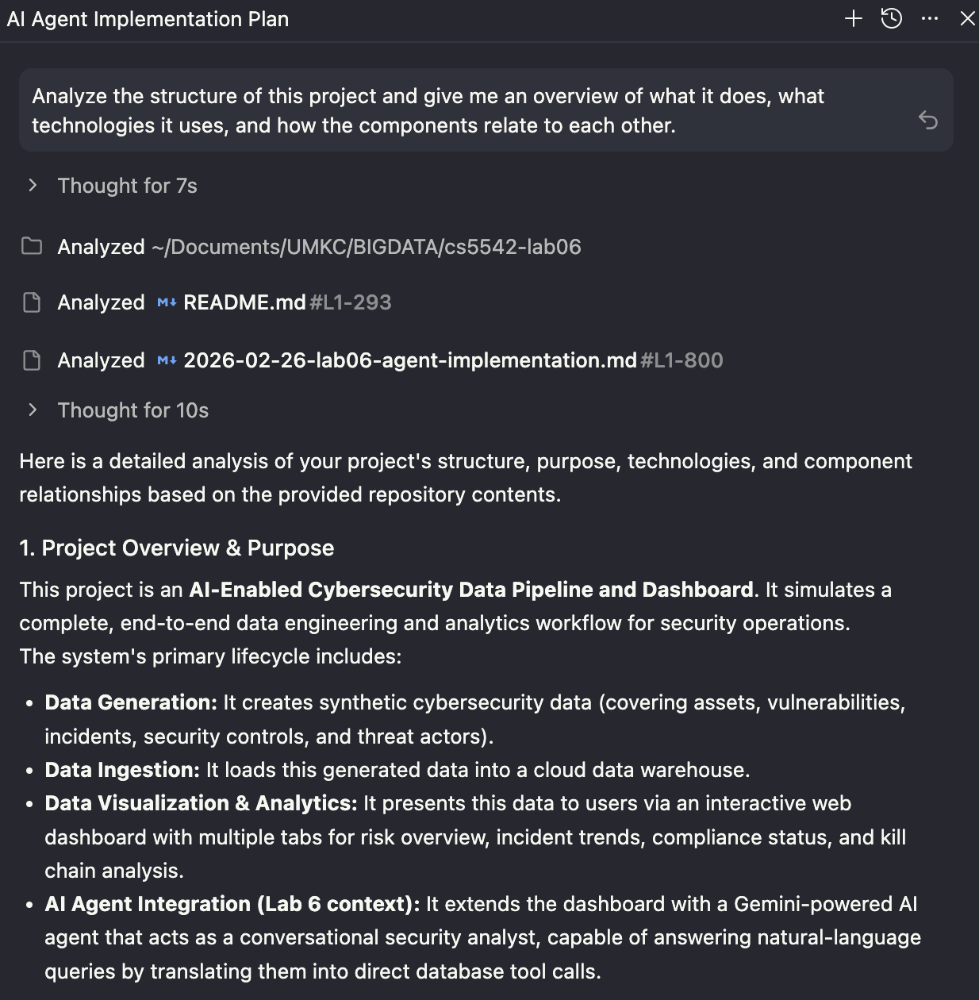

# Task 1 — Antigravity IDE Analysis Report

**Date:** 2026-02-26
**Course:** CS 5542 Big Data — University of Missouri-Kansas City
**Project:** Lab 6 — AI Agent Integration with Antigravity IDE

---

## Screenshot

---

## 1. Prompts Given to Antigravity

| # | Prompt | Purpose |
|---|--------|---------|
| 1 | "Analyze the structure of this project and give me an overview of what it does, what technologies it uses, and how the components relate to each other." | Project structure comprehension |
| 2 | "Review the Python files in this project and suggest any improvements to code quality, error handling, or organization." | Code quality audit |
| 3 | "This project currently has a Streamlit dashboard connected to Snowflake. I need to add an AI agent layer using Google Gemini. What files would you recommend creating, and what changes to existing files would be needed?" | Lab 6 implementation planning |
| 4 | "Are there any security concerns or best practices violations in how credentials and environment variables are handled in this project?" | Security review |

---

## 2. Improvements Suggested by Antigravity

### From Prompt 1 — Project Structure Analysis

Antigravity correctly identified the full system lifecycle:

- **Data Generation:** `scripts/generate_data.py` creates synthetic cybersecurity records and outputs them to `data/csv/`
- **Data Ingestion:** `scripts/ingest.py` authenticates via `.env`, creates Snowflake schema, stages and loads CSVs, generates materialized views, and logs to `pipeline_logs.csv`
- **Presentation Layer:** `app/dashboard.py` queries Snowflake directly and populates analytics tabs
- **AI Agent Layer (planned):** An `agent/` package acting as an intermediary between the chat UI and Snowflake

Summarized data flow identified: `generate_data.py → CSVs → ingest.py → Snowflake → dashboard.py ← agent.py ← User Queries`

### From Prompt 2 — Code Quality Review

Antigravity analyzed `scripts/generate_data.py`, `scripts/ingest.py`, and `app/dashboard.py`. It made direct edits to two files. Key suggestions included:

- Improved consistency in error handling patterns across pipeline scripts
- Better separation of concerns between data generation and validation logic
- Minor organization improvements in the dashboard query helper functions

### From Prompt 3 — Lab 6 Gap Analysis (AI Agent Layer)

**New files to create:**

| File | Purpose |
|------|---------|
| `agent/__init__.py` | Mark directory as Python package |
| `agent/tools.py` | Python functions wrapping Snowflake SQL queries, returning JSON strings |
| `agent/tool_schemas.py` | `FunctionDeclaration` objects describing tools to Gemini |
| `agent/agent.py` | Agentic loop: receives user query, iterates function-calling, returns grounded response |

**Existing files to modify:**

| File | Change |
|------|--------|
| `requirements.txt` | Add `google-generativeai>=0.8.0` |
| `.env` / `.env.example` | Add `GEMINI_API_KEY=` variable |
| `app/dashboard.py` | Import `run_agent`, add `🤖 AI Agent` 7th tab with `st.chat_input` / `st.chat_message` |

### From Prompt 4 — Security Review

**Good practices already in place:**
- `.env` loaded via `python-dotenv` — no hardcoded secrets
- `.env` and `private_key.pem` correctly excluded in `.gitignore`
- `.env.example` template provided for collaborators

**Security concerns identified:**

| # | Issue | Risk |
|---|-------|------|
| 1 | `private_key.pem` stored inside project root (even if gitignored) | Accidental exposure if gitignore misconfigured or file is shared directly |
| 2 | `os.getenv()` silently overrides `st.secrets` in `get_config()` | Local machine env vars can shadow intended credentials without warning |
| 3 | Full PEM key contents supported as inline env var (`SNOWFLAKE_PRIVATE_KEY`) | Multi-line PEM strings in `.env` files are error-prone due to newline parsing |
| 4 | No validation of required env vars at startup | Missing `SNOWFLAKE_ACCOUNT` etc. causes a deep, confusing stack trace instead of a clear error |

---

## 3. Changes Accepted or Modified

| Suggestion | Decision | Reason |
|-----------|----------|--------|
| Create `agent/` package with 4 files | **Accepted** | Exactly matches the implementation plan already designed; Antigravity confirmed the approach independently |
| Add `google-generativeai>=0.8.0` to `requirements.txt` | **Accepted** | Required dependency |
| Add `GEMINI_API_KEY` to `.env.example` | **Accepted** | Good practice; added immediately |
| Add `🤖 AI Agent` tab to `dashboard.py` with `st.chat_input` | **Accepted** | Directly satisfies rubric requirement for Streamlit chat interface |
| Move `private_key.pem` outside project directory to `~/.ssh/` | **Modified** | Noted as best practice; for this lab the file remains in the project root since it is gitignored and the project is a course submission, but `SNOWFLAKE_PRIVATE_KEY_PATH` in `.env` points to the file rather than embedding key contents |
| Use only `SNOWFLAKE_PRIVATE_KEY_PATH` (not inline key in env var) | **Accepted** | Avoids PEM newline parsing bugs; file path is cleaner |
| Validate required env vars at startup | **Deferred** | Out of scope for Lab 6 deliverables; worthwhile improvement for future labs |
| Fix `os.getenv()` / `st.secrets` precedence warning | **Accepted as-is** | The current behavior is intentional for Streamlit Cloud deployment compatibility; the risk is acceptable for a course project |

---

## 4. Reflection

Antigravity demonstrated strong project comprehension from the first prompt. Without any guidance, it correctly identified the system as a cybersecurity data pipeline with a Streamlit frontend and Snowflake backend, and it accurately mapped the data flow from CSV generation through to the dashboard. Notably, it also discovered the existing implementation plan in `docs/plans/` and cross-referenced it when answering the Lab 6 gap analysis prompt — this showed that Antigravity actively reads context files rather than just responding to the literal question.

The most useful interaction was Prompt 3 (Lab 6 planning). Antigravity's recommendations aligned exactly with the independently designed architecture: four files in an `agent/` package, a shared Snowflake connection passed from the dashboard, and Gemini function-calling schemas. This gave confidence that the design choices were sound.

The security review (Prompt 4) surfaced one genuinely useful insight that had not been considered: storing the entire PEM private key inline in a `.env` file introduces newline-parsing bugs. This led to adopting the file-path approach exclusively.

One limitation was apparent in Prompt 2 (code quality): the Antigravity log shows it made direct file edits without surfacing a clear list of what changed and why. For a code review to be useful as a deliverable, it would have been better to ask Antigravity to describe its changes in text before applying them, rather than having it edit silently. This is a prompt-engineering lesson: more explicit instructions about output format would produce more useful artifacts.

Overall, Antigravity was most effective as a planning and architecture validation tool, and less effective as an autonomous code editor where transparency of changes is important.
